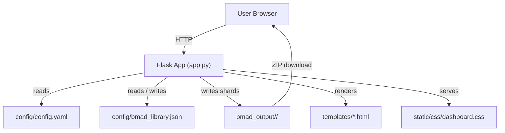
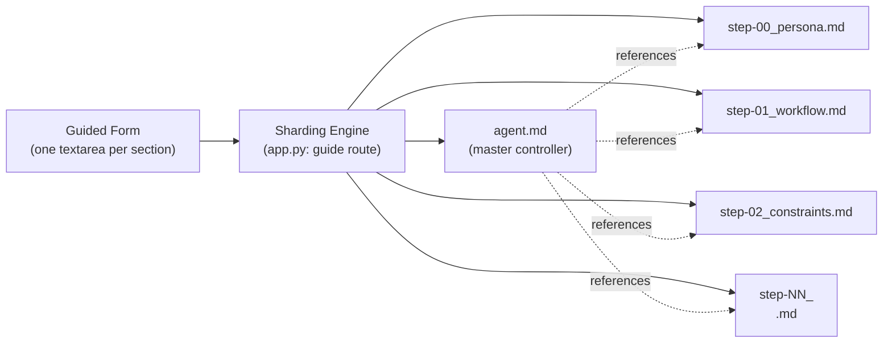
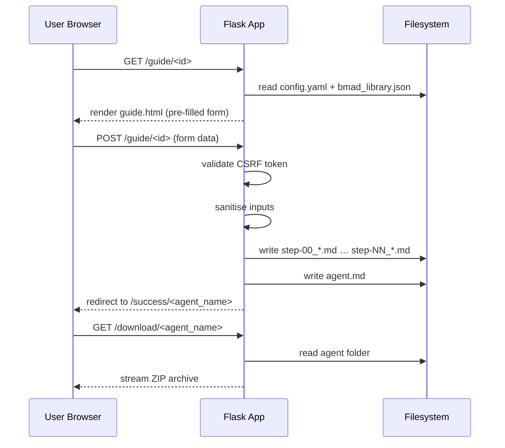
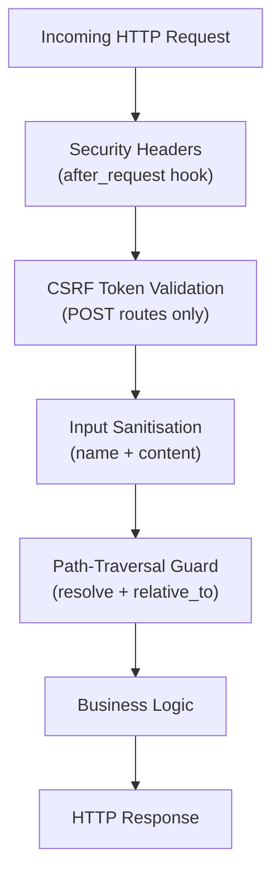

# Architecture Guide — BMAD v6 Template Architect

## 1. Overview

The **BMAD v6 Template Architect** is a lightweight Python Flask web application that guides users through a structured, step-by-step interview process. The output is a folder of sharded Markdown files that are **BMAD v6 compliant** and ready for submission to an AI model.

---

## 2. High-Level Architecture



---

## 3. Component Breakdown

| Component | File(s) | Responsibility |
|---|---|---|
| **Flask App** | `app.py` | Route handling, CSRF, sharding logic, security headers |
| **Config** | `config/config.yaml` | Application settings (title, port, output dir, icon) |
| **Template Library** | `config/bmad_library.json` | Defines agent/document templates and their default section text |
| **HTML Templates** | `templates/*.html` | Jinja2 templates rendered by Flask |
| **Stylesheet** | `static/css/dashboard.css` | Dark-mode UI CSS |
| **Agent Jinja2 Template** | `agent/agent.md.j2` | Reference template for the master agent.md structure |
| **Output** | `bmad_output/<name>/` | Generated sharded Markdown files (gitignored) |
| **Container** | `Containerfile` | Podman/Docker multi-stage build for production deployment |

---

## 4. BMAD v6 Sharding Architecture



Each section of a template becomes a **shard** (a numbered Markdown file). The master `agent.md` contains a checklist of all shards so an AI model can load exactly the context it needs.

---

## 5. Request–Response Flow



---

## 6. Security Architecture



See [`docs/security.md`](security.md) for the full security analysis.

---

## 7. Directory Structure

```
BMAD6/
├── app.py                   # Flask application entry point
├── requirements.txt         # Python dependencies
├── Containerfile            # Podman multi-stage container build
├── .env.example             # Environment variable template
├── .gitignore
│
├── config/
│   ├── config.yaml          # Application settings
│   └── bmad_library.json    # Template library (agents + documents)
│
├── templates/               # Jinja2 HTML templates
│   ├── base.html
│   ├── index.html
│   ├── guide.html
│   ├── dashboard.html
│   ├── success.html
│   ├── amend.html
│   └── error.html
│
├── static/
│   └── css/
│       └── dashboard.css    # Dark-mode stylesheet
│
├── agent/
│   └── agent.md.j2          # Reference Jinja2 shard template
│
├── bmad_output/             # Generated agents & documents (gitignored)
│   └── <agent_name>/
│       ├── agent.md
│       ├── step-00_*.md
│       └── step-NN_*.md
│
├── docs/                    # All project documentation
│   ├── architecture.md      ← this file
│   ├── user_guide.md
│   ├── api_guide.md
│   ├── support_tasks.md
│   ├── raci.md
│   ├── rbac.md
│   ├── security.md
│   ├── maintenance.md
│   ├── deployment.md
│   └── container_build.md
│
├── python/                  # Legacy Django code fragments (reference only)
├── html/                    # Legacy HTML fragments (reference only)
└── scripts/                 # Utility shell scripts
```

---

## 8. Technology Stack

| Layer | Technology | Version |
|---|---|---|
| Language | Python | 3.12+ |
| Web Framework | Flask | 3.0+ |
| Templating | Jinja2 | (bundled with Flask) |
| Config Parsing | PyYAML | 6.0+ |
| Env Management | python-dotenv | 1.0+ |
| HTML Sanitisation | MarkupSafe | 2.1+ |
| Containerisation | Podman | 4.x+ |
| Container Base | python:3.12-slim | (official Docker Hub) |
