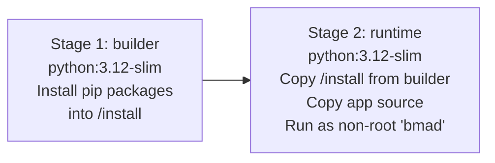

# Container Build Guide — BMAD v6 Template Architect

## 1. Prerequisites

- **Podman** 4.x or later: `podman --version`
- Access to Docker Hub (for the base image `python:3.12-slim`)

---

## 2. Build the Container Image

From the project root directory:

```bash
podman build -t bmad6-architect:latest .
```

### Verify the build

```bash
podman images | grep bmad6-architect
```

Expected output:
```
localhost/bmad6-architect   latest   <hash>   <date>   ~200MB
```

---

## 3. Containerfile Explained

The `Containerfile` uses a **multi-stage build** to keep the runtime image small and free of build tools.



| Instruction | Purpose |
|---|---|
| `FROM python:3.12-slim AS builder` | Minimal Debian-based Python image for dependency installation |
| `RUN pip install --prefix=/install` | Install packages to an isolated prefix for clean copying |
| `FROM python:3.12-slim` | Fresh runtime image (no build caches) |
| `RUN groupadd / useradd bmad` | Create a non-root user to run the application |
| `COPY --from=builder /install` | Copy only the installed packages |
| `COPY --chown=bmad:bmad ...` | Copy app source with correct ownership |
| `USER bmad` | Drop root privileges before starting the app |
| `HEALTHCHECK` | Enables automatic container health monitoring |

---

## 4. Run the Container

### Basic run (development)

```bash
podman run --rm -p 8000:8000 \
  -e SECRET_KEY=$(python -c "import secrets; print(secrets.token_hex(32))") \
  bmad6-architect:latest
```

### Production run with persistent output

```bash
podman run -d \
  --name bmad6 \
  -p 8000:8000 \
  --env-file .env \
  -v ./bmad_output:/app/bmad_output:Z \
  --restart unless-stopped \
  bmad6-architect:latest
```

> `:Z` sets the correct SELinux label on the bind mount (required on RHEL/Fedora/CentOS with SELinux enforcing).

---

## 5. Inspect the Running Container

```bash
# Container status
podman ps

# Application logs
podman logs bmad6

# Tail logs in real time
podman logs --follow bmad6

# Open a shell for debugging (development only)
podman exec -it bmad6 /bin/bash
```

---

## 6. Stop, Remove, and Clean Up

```bash
# Stop the container
podman stop bmad6

# Remove the container
podman rm bmad6

# Remove the image
podman rmi bmad6-architect:latest

# Remove all stopped containers and dangling images
podman system prune
```

---

## 7. Tag and Push to a Registry

```bash
# Tag for a private registry
podman tag bmad6-architect:latest registry.internal.example.com/bmad6/architect:1.0.0

# Login to the registry
podman login registry.internal.example.com

# Push
podman push registry.internal.example.com/bmad6/architect:1.0.0
```

---

## 8. Build with a Specific Tag (Versioning)

```bash
podman build \
  --label "version=1.0.0" \
  --label "maintainer=YourName" \
  -t bmad6-architect:1.0.0 \
  -t bmad6-architect:latest \
  .
```

---

## 9. Security Notes

| Practice | Detail |
|---|---|
| Non-root user | Application runs as `bmad` (UID/GID auto-assigned) |
| Multi-stage build | Build tools not present in runtime image |
| No secrets in image | `SECRET_KEY` injected at runtime via `--env-file` |
| Read-only config | Mount `config/` as read-only if amend route is disabled: `-v ./config:/app/config:ro,Z` |
| Minimal base image | `python:3.12-slim` has a reduced attack surface vs. full Debian |

---

## 10. Troubleshooting

| Symptom | Likely Cause | Resolution |
|---|---|---|
| `Permission denied` on `bmad_output/` | Volume mount ownership mismatch | Run `podman unshare chown bmad:bmad ./bmad_output` or use `:Z` SELinux label |
| `python:3.12-slim` pull fails | No internet access | Pre-pull on a connected machine: `podman pull docker.io/library/python:3.12-slim` |
| Container exits immediately | Missing `SECRET_KEY` or bad `config.yaml` | Check `podman logs bmad6` |
| Port 8000 already in use | Another service on that port | Change the host port: `-p 8080:8000` |
